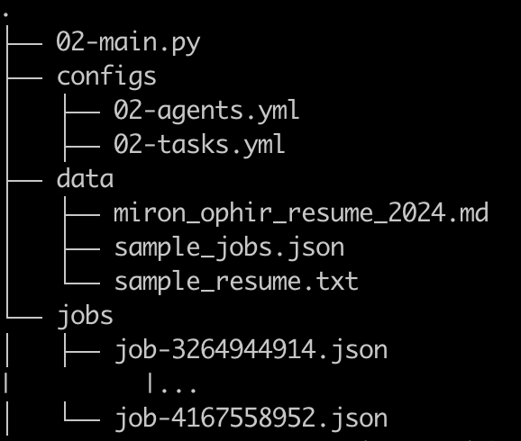
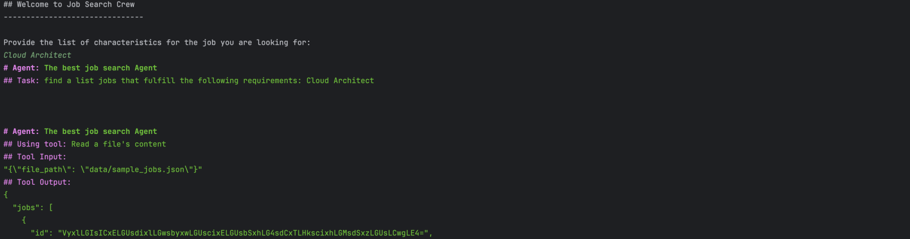
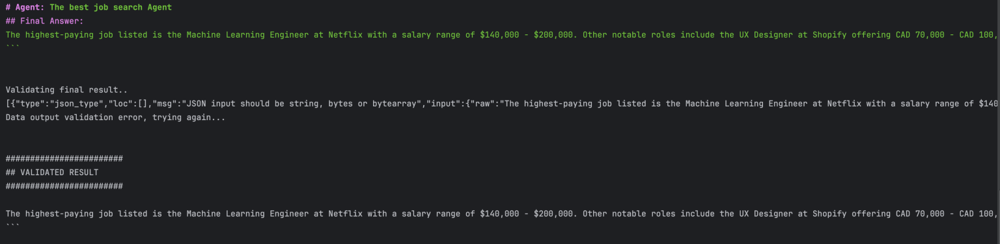
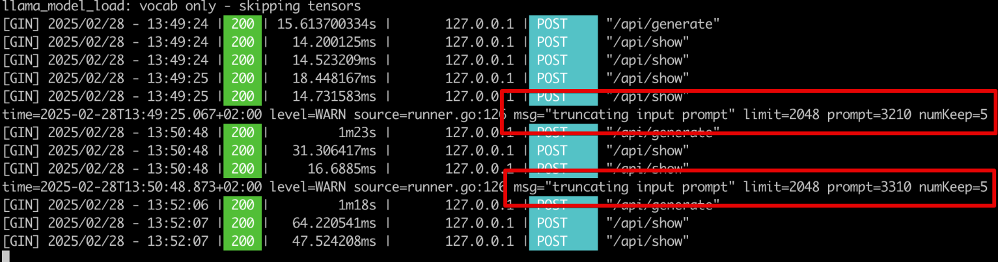
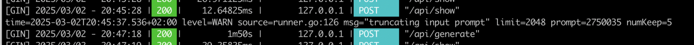

# חיפוש עבודה באמצעות סוכנים חכמים - חלק 2


בחלק הקודם הכנו את אוסף המשרות ואת קורות החיים לעבודתם של הסוכנים.

בחלק הזה נגייס את הסוכן הראשון לצוות שלנו – סוכן החיפוש. נשתמש בספריית CrewAI לצורך כך.

## יצירת הסוכן + בדיקה התחלתית פשטנית
מבנה הקבצים לחלק הזה הינו:



בספריית קונפיגורציה נגדיר את הסוכנים והמשימות, בספריית דאטה יהיו קו"ח וקבצי עזר לבדיקה, ובספריית jobs יהיו כל קו"ח שאספנו בחלק הקודם.

אלו הגדרות הסוכן והמשימה:

`agents.yml`
```yaml
job_search_expert:
  role: The best job search Agent
  goal: Impress all requesters with finding the best job postings and advertisements
  backstory:  The most seasoned job search analyst with lots of expertise in the job market
```
`tasks.yml`
```yaml
job_search:
  description: |
    find a list jobs that fulfill the following requirements: {query}
  expected_output: A structured output as a valid json with the list of jobs found with all their information. Make sure that field names are kept the same.
```

וזה מה שנריץ:

```python
import os
import yaml
from textwrap import dedent
from typing import Optional, List, Any

from crewai import Agent, Crew, Process, Task
from crewai_tools import FileReadTool
from dotenv import load_dotenv
from langchain_openai import ChatOpenAI
from pydantic import BaseModel, ValidationError

load_dotenv()

def load_config(config_path):
    with open(config_path, 'r') as file:
        return yaml.safe_load(file)


class Job(BaseModel):
    id: Optional[str]
    location: Optional[str]
    title: Optional[str]
    company: Optional[str]
    description: Optional[str]
    jobProvider: Optional[str]
    url: Optional[str]
    rating: Optional[int]
    rating_description: Optional[str]
    company_rating: Optional[int]
    company_rating_description: Optional[str]


class JobResults(BaseModel):
    jobs: Optional[List[Job]]


class AgentsFactory:
    def __init__(self, config_path):
        self.config = load_config(config_path)

    def create_agent(
        self,
        agent_type: str,
        llm: Any,
        tools: Optional[List] = None,
        verbose: bool = True,
        allow_delegation: bool = False,
    ) -> Agent:
        agent_config = self.config.get(agent_type)
        if not agent_config:
            raise ValueError(f"No configuration found for {agent_type}")

        if tools is None:
            tools = []

        return Agent(
            role=agent_config["role"],
            goal=agent_config["goal"],
            backstory=agent_config["backstory"],
            verbose=verbose,
            tools=tools,
            llm=llm,
            allow_delegation=allow_delegation,
        )


class TasksFactory:
    def __init__(self, config_path):
        self.config = load_config(config_path)

    def create_task(
        self,
        task_type: str,
        agent: Agent,
        query: Optional[str] = None,
        output_schema: Optional[str] = None,
    ):
        task_config = self.config.get(task_type)
        if not task_config:
            raise ValueError(f"No configuration found for {task_type}")

        description = task_config["description"]
        if "{query}" in description and query is not None:
            description = description.format(query=query)

        expected_output = task_config["expected_output"]
        if "{output_schema}" in expected_output and output_schema is not None:
            expected_output = expected_output.format(output_schema=output_schema)

        return Task(
            description=dedent(description),
            expected_output=dedent(expected_output),
            agent=agent,
        )


class JobSearchCrew:
    def __init__(self, query: str):
        self.query = query

    def run(self):
        os.environ['OPENAI_API_KEY'] = 'ollama'
        llm = ChatOpenAI(
            model="ollama/deepseek-r1:14b",
            base_url="http://localhost:11434/v1",
            max_tokens=32768,
        )

        # Initialize all tools needed
        jobs_file_read_tool = FileReadTool(file_path="data/sample_jobs.json")

        # Create the Agents
        agent_factory = AgentsFactory("configs/02-agents.yml")
        job_search_expert_agent = agent_factory.create_agent(
            "job_search_expert", tools=[jobs_file_read_tool], llm=llm
        )

        # Create the Tasks
        tasks_factory = TasksFactory("configs/02-tasks.yml")
        job_search_task = tasks_factory.create_task(
            "job_search", job_search_expert_agent, query=self.query
        )

        # Assemble the Crew
        crew = Crew(
            agents=[
                job_search_expert_agent,
            ],
            tasks=[
                job_search_task,
            ],
            verbose=1,
            process=Process.sequential,
        )

        result = crew.kickoff()
        return result


if __name__ == "__main__":
    print("## Welcome to Job Search Crew")
    print("-------------------------------")
    query = input(
        dedent("""
      Provide the list of characteristics for the job you are looking for: 
    """)
    )

    crew = JobSearchCrew(query)
    result = crew.run()

    print("Validating final result..")
    try:
        validated_result = JobResults.model_validate_json(result)
    except ValidationError as e:
        print(e.json())
        print("Data output validation error, trying again...")

    print("\n\n########################")
    print("## VALIDATED RESULT ")
    print("########################\n")
    print(result)
```

ואלו התוצאות. הפרומפט שביקשנו בהרצה היה Cloud Architect:





זה עובד, בערך…

יש כמה בעיות שניתן לציין ביישום הזה:

הקוד רץ על קובץ משרות לדוגמה שכלל מספר קטן של משרות שחוברו לקובץ json יחיד. אנחנו רוצים לעבור על כל המשרות שכל אחת מהן נמצאת בקובץ משלה.
הפרומפט שבחרנו נבחר כך שיניב תוצאות לעבודת הסוכן. פרומפטים אחרים או מורכבים יותר לא מצאו תוצאות בחיפוש.
אם נסתכל על הלוגים של ollama נבחין באזהרה מטרידה:



זה עשוי לרמז על בעייה בהפעלת ה-LLM שכן יתכן והפרומפט שלנו לא יובן במלואו.

שימוש בכל המשרות
נסיון אפשרי לפתור את הבעיות הנ"ל יהיה לאחד את כל המשרות שלנו לקובץ אחד, ולהשתמש בו. זה רק מחריף את בעיית כמות הטוקנים בפרומפט:



ןהפרומפט "Cloud Architect" שמצא משרות בקובץ הבדיקה, לא מחזיר תוצאות רלוונטיות – אלא משרות מפתח iOS. ??? כנראה שהסוכן לא נחשף לכל המשרות, בגלל הבעייה הנ"ל.

כדי לפתור את הבעיות הללו, ננסה להשתמש בדמיון סמנטי שישתמש באמבדינגים ווקטוריים. אך על כך בפרק הבא.

תמונת השער יוצרה באמצעות AI באתר tensor.art