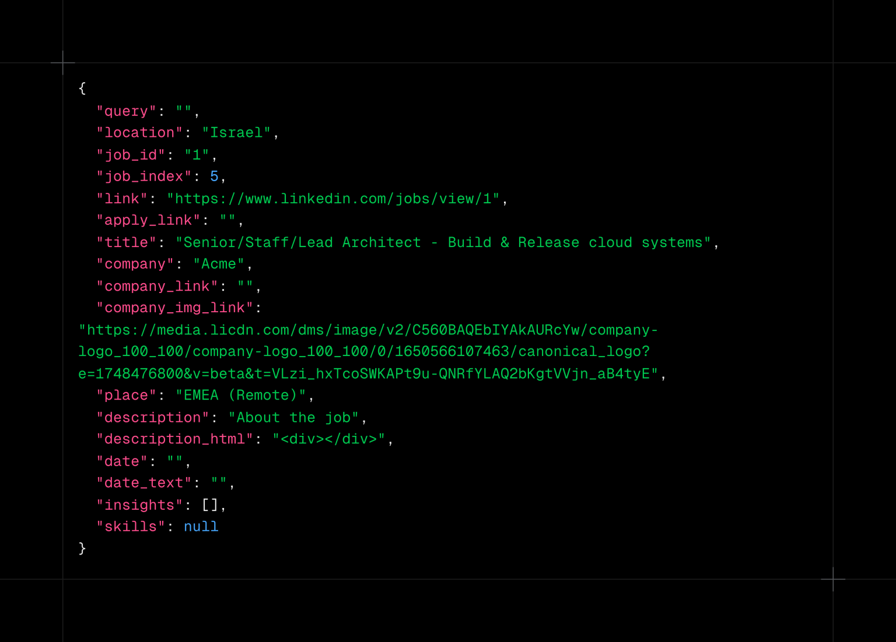
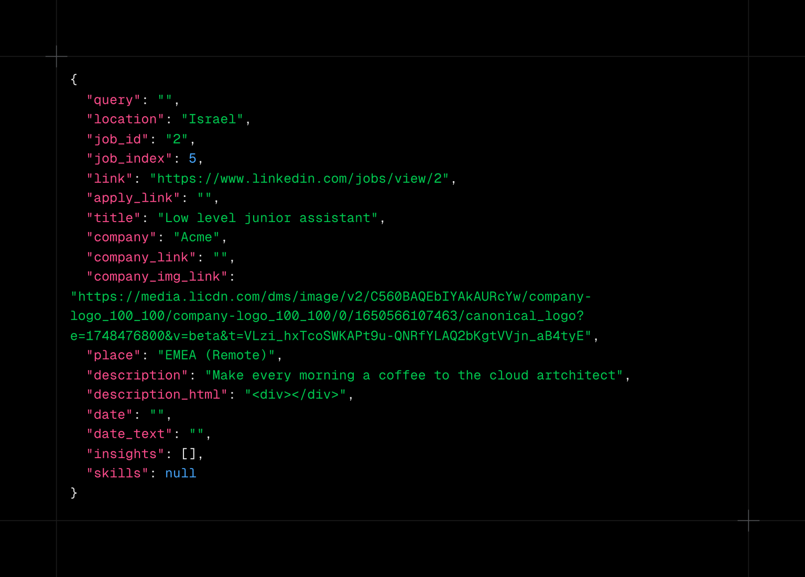

# חיפוש עבודה באמצעות סוכנים חכמים - חלק 3


בחלקים הקודמים (חלק 1, חלק 2) נתקל סוכן המשרות החכם שלנו בבעיה של כמות הטוקנים הגדולה בפרומפט, בגלל גודלו של קובץ המשרות.


בחלק הזה ננסה למצוא דרך לעזור לסוכן החכם לאתר קרבה סמנטית של המשרה(ות) לפרומפט המבוקש. אחת הדרכים הנפוצות בדוגמאות רבות של RAG ומערכות סוכנים חכמים היא השימוש בהטמעות (embeddings) בכדי לאתר קרבה סמנטית. התהליך כולל בדרך כלל ייצור וקטורי הטמעות למסמכי החיפוש ולפרומפט (אני מסרב להשתמש במילה העברית מנחה) ומציאת הקרבה ביניהם. הסבר על התיאוריה וכל נושא ההטמעות הוא מעבר למתוכנן עבור פוסט זה – אבל ניתן למצוא מידע רב ברשת. יש כאלו הטוענים לחסרונות בשיטה זו (למשל: The Insanity of Relying on Vector Embeddings: Why RAG Fails) אבל לצורך הדוגמה שלנו זו כנראה שיטה לגיטימית לבדוק האם היא תניב תוצאות קבילות.

בהרבה מאוד דוגמאות, וכנראה במערכות פרודקשן, נעשה שימוש באכסון של וקטורי ההטמעות – בדרך כלל בבסיסי נתונים ייעודיים לנושא כמו Chroma DB ודומיו. אבל בדוגמה הפשוטה שלנו נייצר את ההטמעות בכל הרצה.

לצורך בדיקה, נשתמש בשתי משרות לדוגמה. האחת מתאימה מאוד לפרומפט של "Cloud Architect" , והאחרת פחות.



משרה זו מתאימה – job-1.json



משרה זו אינה מתאימה – job-2.json

נריץ את הקוד הזה למציאת מידת הקרבה לפרומפט:

```python
import json

from langchain_ollama.embeddings import OllamaEmbeddings
import numpy as np

def cosine_similarity(A, B):
    dot_product = np.dot(A, B)
    magnitude_A = np.linalg.norm(A)
    magnitude_B = np.linalg.norm(B)
    return dot_product / (magnitude_A * magnitude_B)

if __name__ == "__main__":
    ollama_embeddings = OllamaEmbeddings(model="mxbai-embed-large")
    with open("data/job-1.json", "r") as f:
        job1 = f.read()
    with open("data/job-2.json", "r") as f:
        job2 = f.read()
    prompt = "Cloud Architect"
    job_embeddings = ollama_embeddings.embed_documents([job1, job2])
    prompt_embeddings = ollama_embeddings.embed_query(prompt)
    print(f"""
    Cosine similarity to job1: {cosine_similarity(prompt_embeddings, job_embeddings[0])}
    Cosine similarity to job2: {cosine_similarity(prompt_embeddings, job_embeddings[1])}
    """)

    job1_json = json.loads(job1)
    job2_json = json.loads(job2)
    job_embeddings = ollama_embeddings.embed_documents([job1_json["title"], job2_json["title"]])
    print(f"""
    Cosine similarity to job1 title: {cosine_similarity(prompt_embeddings, job_embeddings[0])}
    Cosine similarity to job2 title: {cosine_similarity(prompt_embeddings, job_embeddings[1])}
    """)
```

כשמריצים מתקבלת התוצאה הבאה:

```shell
Cosine similarity to job1: 0.5836322943367188
Cosine similarity to job2: 0.5218661225791285
    

Cosine similarity to job1 title: 0.7767796108694911
Cosine similarity to job2 title: 0.46854531550568995
```

ניתן לראות ששתי המשרות קרובות מאוד בהתאמתן לפרומפט אם ההטמעות נעשות על כל הטקסט של המשרה, אבל אם ההטמעה נעשית רק על התואר של המשרה יש העדפה מובחנת למשרה שבאמת מתאימה יותר לפרומפט.

בחלק הבא ננסה לתת לסוכן החכם כלים שיזרו לו לחפש באופן יעיל יותר במאגר המשרות.

תמונת השער יוצרה באמצעות AI באתר tensor.art
