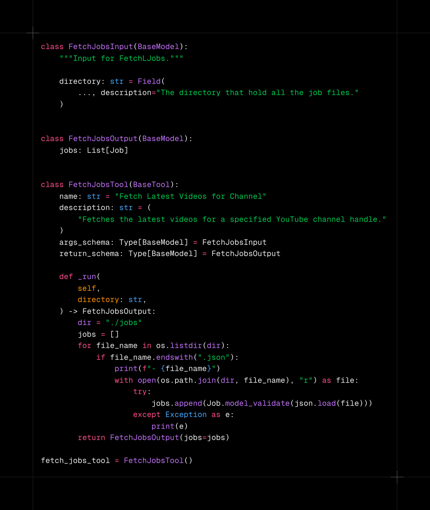
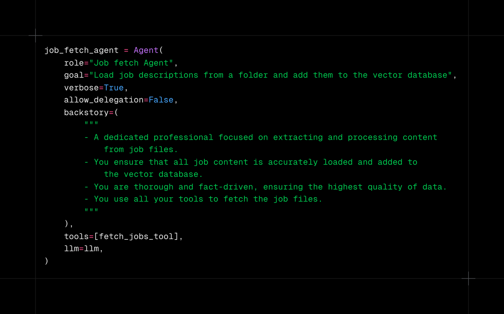
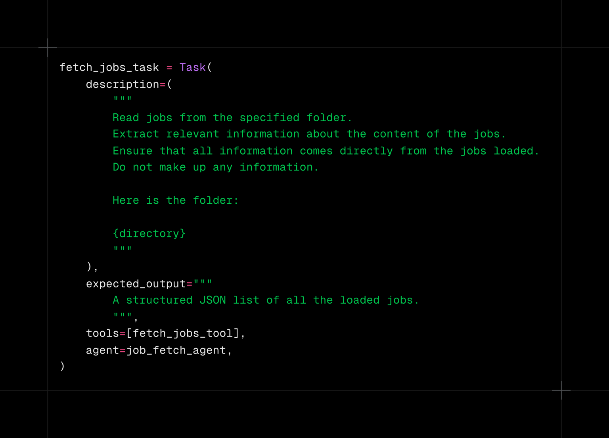
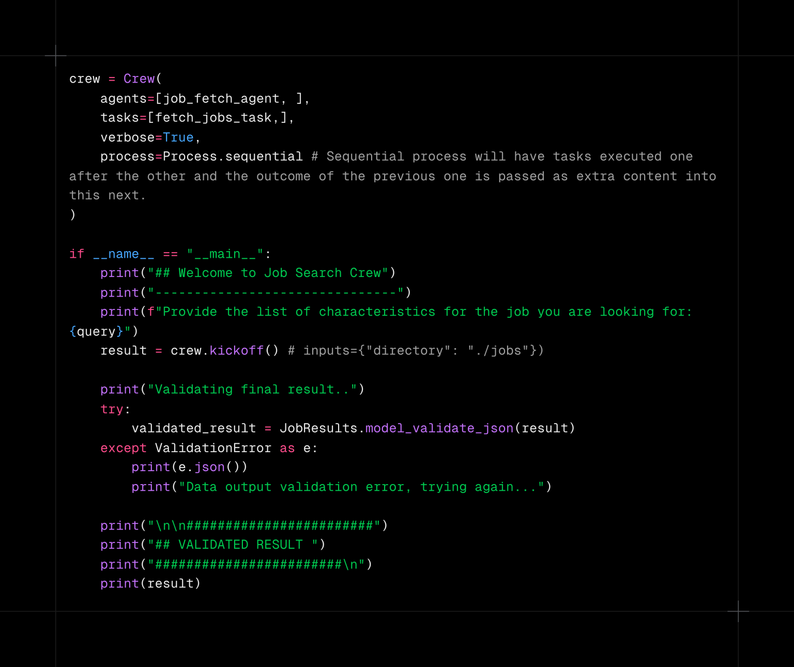
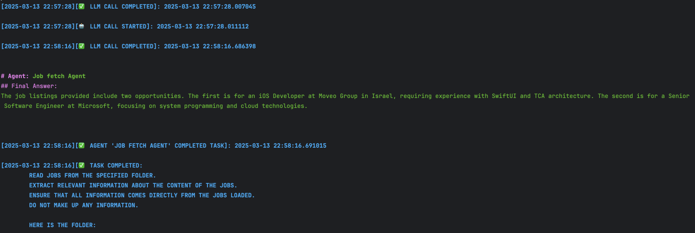

# חיפוש עבודה באמצעות סוכנים חכמים - חלק 4

בחלקים הקודמים (חלק 1 ■ חלק 2 ■ חלק 3) נתקל סוכן המשרות החכם שלנו בבעיה של כמות הטוקנים הגדולה בפרומפט, בגלל גודלו של קובץ המשרות. רצינו לראות האם הטמעות וקטוריות יפתרו את הבעיה ואכן חיפוש משרה לפי ההטמעות (בכותרת המשרה או בכל התיאור) נותן התאמות טובות.

בחלק הזה ננסה ליישם את ההטמעות הווקטוריות בתהליך העבודה של הסוכנים החכמים.
שלחנו את סוכן החיפוש החכם לחופשה ארוכה בבית וגייסנו במקומו סוכן חכם זוטר שידע להפעיל כלים שיטענו את כל קבצי תיאור המשרות ויכינו את ההטמעות הווקטוריות שלהם. בחלק זה נתמקד בטעינת הקבצים ע"י הסוכן החכם.

לצורך טעינת קבצי המשרות, נכין כלי עבודה (Tools) שהסוכן יוכל להפעיל כדי לבצע את משימותיו.

וזה הסוכן החדש שלנו:

שקיבל משימה אחת ויחידה – לטעון את הקבצים ולהחזיר אותם בפורמט מובנה של רשימת משרות:

וכמובן הצוות שלנו כולל כרגע רק את הסוכן הבודד הזה:

כאשר מריצים את הצוות הזה, ניתן לראות בשורות הלוג כי הסוכן מפעיל את כלי אעינת המשרות, שמחזיר את רשימת כל המשרות. לאחר מכן נותן הסוכן את התפוקה הבאה:

יש עדיין בעיה של כמות הטוקנים שהסוכן יכול לחפש בה ולכן המשרות המוחזרות לא רלוונטיות לחיפוש שלנו. בחלק הבא נוסיף לסוכן משימות של יצירת ההטמעות הווקטוריות כהכנה למסירת המשך הטיפול בחיפוש לסוכן חדש.

אחדים מקוראי יעירו, אולי בצדק, שלא צריך בכלל סוכן למשימה הזאת – אפשר פשוט להריץ קוד פייתוני שיטען את קבצי המשרות ויחזיר רשימה של משרות. זה נכון – אבל המטרה בחלק הזה היתה בעיקר להדגים איך ניתן לייצר Tool שמקבל קלט מובנה ומייצר פלט מובנה לשימושו של הסוכן החכם.

הקוד כולו מופיע כאן. לצורך הפשטות כללתי את כל הקוד בקובץ בודד וכן עברתי לייצור הסוכנים/משימות/כלים בקוד ולא באמצעות קונפיגורציות yaml.

תמונת השער יוצרה באמצעות AI באתר tensor.art