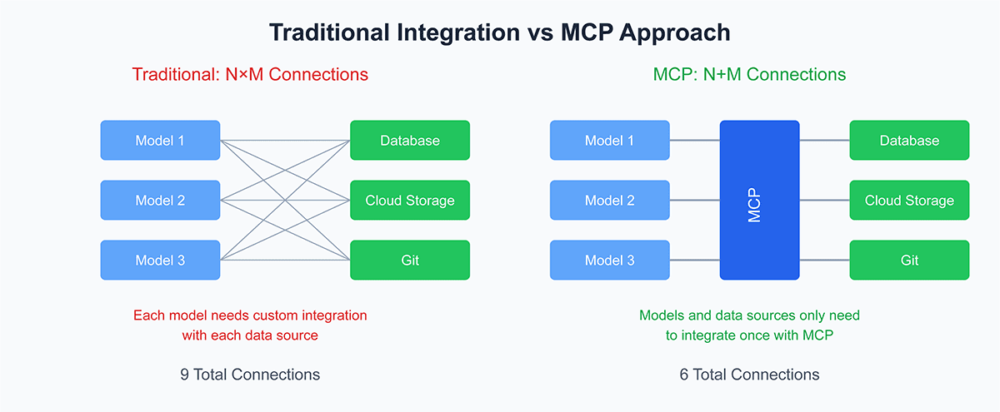
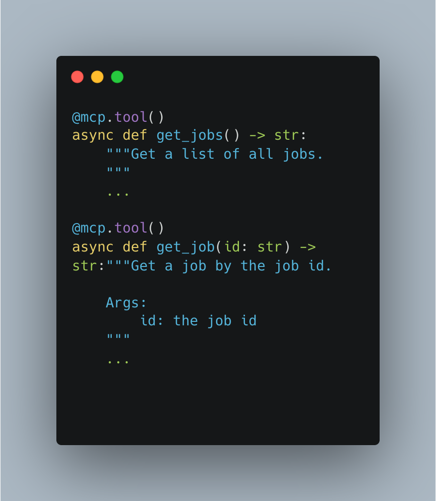
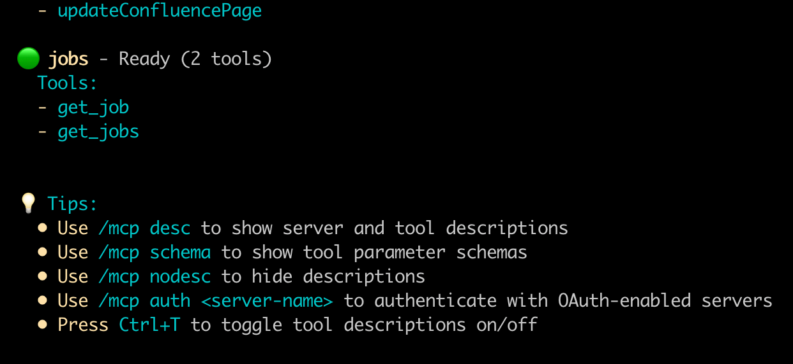
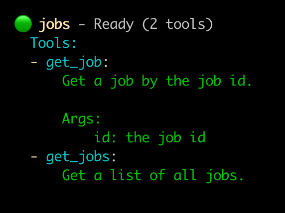

# חיפוש עבודה באמצעות סוכנים חכמים - חלק  5


בחלק הקודם ראינו כיצד הסוכן החכם יכול להשתמש בכלים שאנחנו מעמידים לרשותו. לפתרון הזה מספר בעיות:.

* לכל כלי יש ממשק משלו שדורש קידוד ספציפי המותאם לאותו כלי.
* כלים שונים שמבצעים את אותה משימה עלולים לחשוף ממשק שונה שהסוכן חייב לממש.
* יש הרבה כלים שנוצרו בקהילות קוד פתוח, אבל לכל פרוייקט כזה ממשק משלו. אין אחידות, ולכן קשה להשתמש בכלים אחרים מבלי לבצע התאמות בקוד לכל כלי.

הבעיות הללו מגדילות את סיבוכיות פיתוח פרוייקטי AI שלא לצורך (בעיית ה M כפול N). אם יש לנו M יישומי AI ו-N כלים, כמות ההתאמות בקוד שמתטרך לבצע כדי להשתמש בכלים הללו תהיה M*N.

כדי לפתור את הביות הללו, נוצר פרוטוקול ה-MCP (Model Context Protocol). זהו תקן פתוח שנוצר ע"י חברת אנתרופיק ב-2024 ונועד לתקנן את הדרך שבה סוכנים מתקשרים עם כלים חיצוניים.

התקן מפחית את סיבוכיות הפיתוח ל N + M:



How MCP solves the MxN integration problem. Source: SalesforceDevops
התקן מאפשר גישה סטנדרטית לכלים, משאבים חיצוניים ופרומפטים. היישום מורכב משרת (יכול להיות מקומי או מרוחק) החושף פונקציות, מקורות מידע אן כלים בממשק סטנדרטי. אליו מתחבר הלקוח המשמש כמתווך בין יישום ה-AI (המכונה גם "מארח" – IDE, שרת AI מרוחק, סוכן AU או כלי מקומי) לשרת ה-MCP. הלקוח מטפל בתקשורת לפי הגדרות הפרוטוקול ובהעברת המידע והפקודות. הסבר נרחב ניתן למצוא בתיעוד של אנתרופיק.

לצרכי לימוד ננסה לבנות בפרוייקט שלנו שרת MCP שיבצע את הפעולות הבאות:

* יחזיר רשימה של כל המשרות הפתוחות.
* יספק מידע על משרה מסויימת.

הקוד המלא מופיע כאן.

והוא מבוסס בעיקר על הפונקציות הבאות:



בכדי להריץ את שרת ה-MCP, הורידו את הקוד, עברו לספריית part-05:
```shell
uv sync
uv run jobs.py
```

בכדי לבדוק אם השרת עובד כהלכה יש לגשת אליו מלקוח MCP. אפשר לעשות זאת באמצעות סביבות פיתוח מקומיות כמו: Claude Desktop, Cursor וכו'. אני אשתמש ב- Gemini CLI.

נוסיף את שרת ה-MCP שלנו להגדרות של ה-Gemini CLI:
`File: ~/.gemini/settings.json`
```json
{
  ...,
  "mcpServers": {
    ...,
    "jobs": {
      "command": "uv",
      "args": [
        "--directory",
        "/ABSOLUTR_PATH_TO_PROJECT/linkedin_jobs_ai/part-05",
        "run",
        "jobs.py"
      ]
    }

  }
}
```

ואם נריץ את פקודת:
`
/mcp tools
`

נקבל את שרת ה-MCP שלנו:



ועם פקודת:

`/mcp desc`

נקבל תיאור של הפעולות הנתמכות (הכלים) בשרת שלנו:



בפוסט הבא נראה כיצד הסוכנים יכולים להשתמש בשרת ה-MCP שלנו.

לצורך הפשטות, הכלים של השרת שלנו מחזירים את התשובה כמחרוזת טקסט. ניתן להחזיר גם תשובה מובנית (לדוגמה JSON), אך על כך בהמשך.

תמונת השער יוצרה באמצעות AI באתר tensor.art


## A Simple MCP Jobs Server written in Python
```
clone the repo.
cd to /part-05
uv sync
uv run jobs.py

or run the tests:
pytest test_jobs.py -v
```